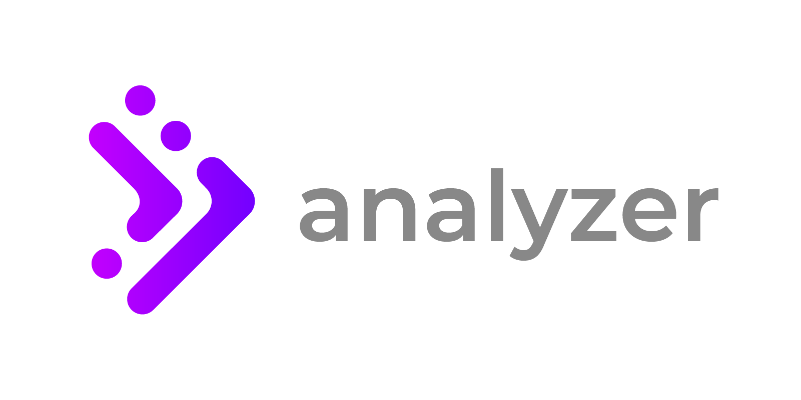

# Presto Workload Analyzer

<p align="center">
    
</p>

The Workload Analyzer collects Presto® and Trino workload statistics, and analyzes them. The analysis provides improved visibility into your analytical workloads, and enables query optimization - to enhance cluster performance.

The Presto® Workload Analyzer collects, and stores, [QueryInfo](https://github.com/trinodb/trino/blob/master/core/trino-main/src/main/java/io/trino/execution/QueryInfo.java) JSONs for queries executed while it is running, and any historical queries held in the Presto® Coordinator memory. 

The collection process has negligible compute-costs, and does not impact cluster query execution in any way.
Ensure that sufficient disk space is available in your working directory. Typically, a compressed JSON file size will be 50kb - 200kb.

## **Table of contents**
- [Features](#Features)
- [Supported Versions of Presto](#Supported-Versions-of-Presto)
- [Installation](#Installation)
- [Usage](#Usage)
- [Screencasts](#Screencasts)
- [Advanced Features](#Advanced-Features)
- [Notes](#Notes)

## Features 
* Continuously collects and stores [QueryInfo](https://github.com/trinodb/trino/blob/master/core/trino-main/src/main/java/io/trino/execution/QueryInfo.java) JSONs, in the background without impacting query performance.
* Summarizes key query metrics to a summary.jsonl file.
* Generates an analysis [report](https://varada.io/wa-sample-report/):
  * Query detail- query peak memory, input data read by query, and joins distribution.
  * Table activity- wall time utilization, and input bytes read, by table scans.
  * Presto® Operators- wall time usage, and input bytes read, by operator.

## Supported Versions of Presto
The Workload Analyzer supports the following versions:
1. Trino (FKA PrestoSQL)- 402 and older.
2. PrestoDB- 0.245.1 and older.
3. Starburst Enterprise- 402e and older.
4. Dataproc- 1.5.x and older.

Although the Workload Analyzer may run with newer versions of Presto®, these scenarios have not been tested.

## Installation
For installation, see [here](INSTALL.md).

## Usage
#### Local machine/ Remote machine
First, go to the `analyzer` directory, where the Workload Analyzer Python code can be found.
```bash
cd analyzer/
```
To collect statistics from your cluster, run the following script for a period that will provide a representative sample of your workload.
```bash
./collect.py -c http://<presto-coordinator>:8080 --username-request-header "X-Trino-User" -o ./JSONs/ --loop
```
Notes:
1. In most cases, this period will be between 5 and 15 days, with longer durations providing more significant analysis.
2. The above command will continue running until stopped by the user (Ctrl+C).

To analyze the downloaded JSONs directory (e.g. `./JSONs/`) and generate a zipped HTML report, execute the following command:
```bash
./extract.py -i ./JSONs/ && ./analyze.py -i ./JSONs/summary.jsonl.gz -o ./output.zip
```

#### Docker

To collect statistics from your cluster, run the following script for a period that will provide a representative sample of your workload.
```bash
$ mkdir JSONs/
$ docker run -v $PWD/JSONs/:/app/JSONs analyzer ./analyzer/collect.py -c http://$PRESTO_COORDINATOR:8080 --username-request-header "X-Trino-User" -o JSONs/ --loop
```
To analyze the downloaded JSONs directory (e.g. `./JSONs/`), and generate a zipped HTML report, execute the following commands:
```bash
$ docker run -v $PWD/JSONs/:/app/JSONs analyzer ./analyzer/extract.py -i JSONs/
$ docker run -v $PWD/JSONs/:/app/JSONs analyzer ./analyzer/analyze.py -i JSONs/summary.jsonl.gz -o JSONs/output.zip
```
Notes:
1. In most cases, this period will be between 5 and 15 days, with longer durations providing more significant analysis.
2. The above command will continue running until stopped by the user (Ctrl+C).


## Screencasts

See the following screencasts for usage examples:


#### Collection

[](https://asciinema.org/a/AmMKV9jFT5bpNJQfbt8D6qKMy)

#### Analysis

[](https://asciinema.org/a/1AqxvxYtoIPjzjFEMGeU1p7yR)

## Advanced Features

- In exceptional circumstances, it may be desirable to do one or more of the following:
1. Obfuscate the schema names
2. Remove the SQL queries from the summary file
3. Analyze queries for a specific schema (joins with other schemas are included)


To enable these requirements, the `./jsonl_process.py` script may be executed, after the `./extract.py` script, but before the `./analyze.py` script.

In the example below, only queries from the `transactions` schema are kept, and the SQL queries are removed from the new summary file: 
```bash
./jsonl_process.py -i ./JSONs/summary.jsonl.gz -o ./processed_summary.jsonl.gz --filter-schema transactions --remove-query 
```

In the following example, all the schema names are obfuscated:
```bash
./jsonl_process.py -i ./JSONs/summary.jsonl.gz -o ./processed_summary.jsonl.gz --rename-schemas 
```

In the following example, all the partition and user names are obfuscated:
```bash
./jsonl_process.py -i ./JSONs/summary.jsonl.gz -o ./processed_summary.jsonl.gz --rename-partitions --rename-user 
```

After the `./jsonl_process.py` script has been executed, to generate a report based on the new summary file, run:
```bash
./analyze.py -i ./processed_summary.jsonl.gz -o ./output.zip
```
- To create a high-contrast report, use the `--high-contrast-mode` parameter, for example:
```bash
./analyze.py --high-contrast-mode -i ./JSONs/summary.jsonl.gz -o ./output.zip
```


## Notes

Presto® is a trademark of The Linux Foundation.
